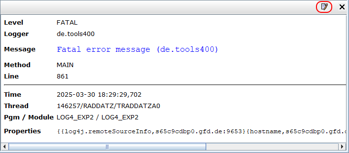
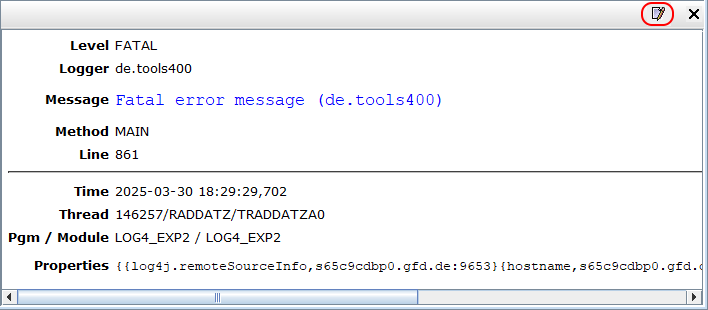
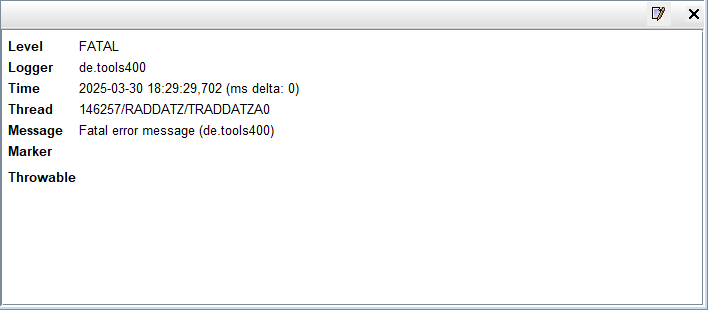

# Chainsaw - Installation

First of all make sure to have a **Java 11** installed, because *Chainsaw 2.1* does not run with *Java 8* or *Java 17*.

Then download **download** the `apache-chainsaw-2.1.0-standalone.zip` package from the [Apache Chainsaw](https://logging.apache.org/chainsaw/2.x/) homepage.

Unzip the content of the zip file into a directory of your choice, for example `c:\Program Files\Chainsaw`. Now *Chainsaw* can be launched with `chainsaw.bat`.

## Additions

### Details Panel Layout

The following layouts have been changed for RPG. You can assign it to the details panel once you have some log events:

[Left Aligned](assets/detail-panel-custom-layout-left-aligned.html)

[Right Aligned](assets/detail-panel-custom-layout-right-aligned.html)

[Original Layout](assets/detail-panel-original-layout.html)

### XMLSocketHubReceiver

Optionally add the [XMLSocketHubReceiver.jar](assets/XMLSocketHubReceiver.jar) to the *Chainsaw* classpath. The `XMLSocketHubReceiver` enables *Chainsaw*  to connect to a [XMLSocketHubAppender](appender/Appender___XMLSocketHubAppender.md) of *Log4rpg*.

***
© 2000-2025, Thomas Raddatz
