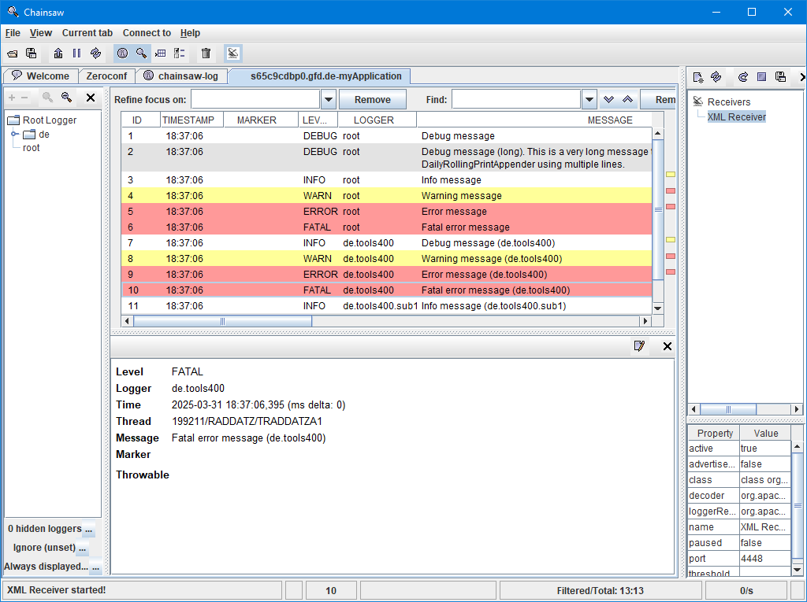

# Chainsaw - Overview

*Chainsaw* is a GUI utility to let you view and analyze your log entries. It is part of the *Apache* [Logging services](https://logging.apache.org/chainsaw/2.x/) project.

*Chainsaw* dramatically eases digging into log events. It can use different colors for the different log levels. It lets you filter the log events. It can put a focus on the log events of a logger or ignore events. But the very best thing of Chainsaw is its capability to receive log events from remote systems via TCP/IP connections.

The image above shows the log event details panel formatted with the default configuration of *Chainsaw*. The default configuration is not the best for to RPG.

Refer to [Chainsaw Installation](Chainsaw___Installation.md) for alternatives.

## See Also

- [Chainsaw - Installation](Chainsaw___Installation.md#details_panel_layout)
- [Chainsaw - Settings files](Chainsaw___Settings_files.md)

***
© 2000-2025, Thomas Raddatz
