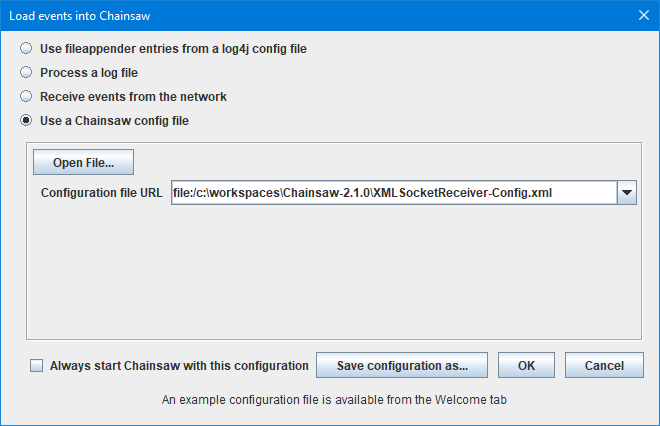
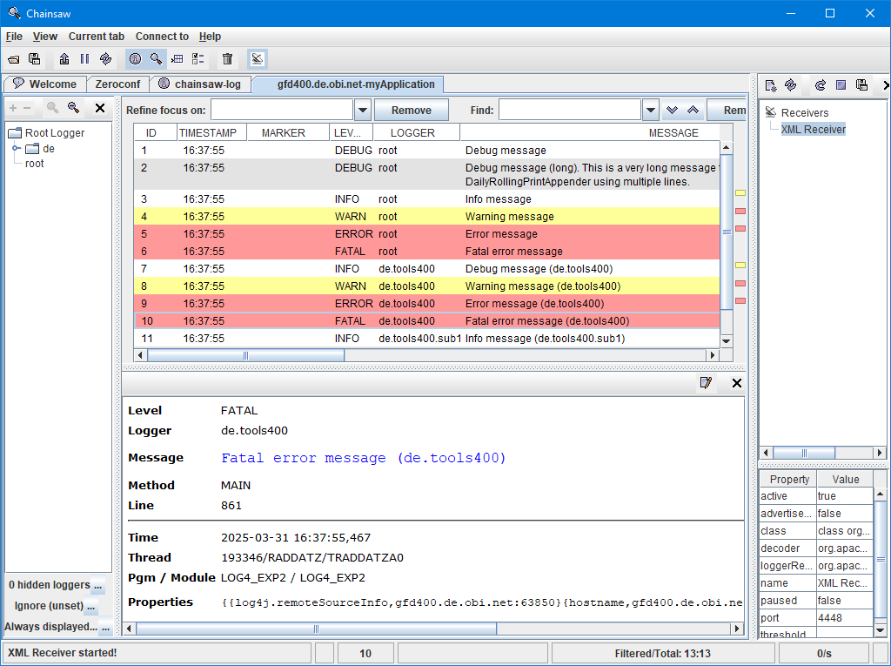

# Configuration - XML Output to Chainsaw

This example shows how to configure a [XMLSocketAppender](appender/Appender___XMLSocketAppender.md) which uses a [XMLLayout](layout/Layout___XMLLayout.md) producing XML output. The XML output is send to [Chainsaw](Chainsaw___Overview.md) on a PC.

## Configuration Data

Disables the Log4rpg internal debug log:

```properties
log4rpg.debug=off, printer
```

Sets the default log level to `ERROR` and names the default appender `chainsaw`:

```properties
log4rpg.rootLogger=ERROR, chainsaw
log4rpg.logger.de.tools400=INFO
```

Configures the `chainsaw` appender:

```properties
log4rpg.appender.chainsaw=\*LIBL/LOG4SCKAPP(XMLSocketAppender)
log4rpg.appender.chainsaw.remoteHost=localclient
log4rpg.appender.chainsaw.port=4448
log4rpg.appender.chainsaw.layout=XMLLayout
log4rpg.appender.chainsaw.layout.replaceUnprintableCharacters=true
log4rpg.appender.chainsaw.filter=appName
```

These entries define a `XMLSocketAppender` which uses a `XMLLayout` and a filter named `appName`. The TCP/IP address is specified as `localclient`, which resolces to the TCP/IP address of the current 5250 job in the *IBM i*.

Configures a filter that adds a property called `application` with a value of `myApplication`:

```properties
log4rpg.filter.appName=\*LIBL/LOG4PROFLT(PropertyFilter)
log4rpg.filter.appName.property.application=myApplication
```

The `PropertyFilter` is used for adding an `application` property to each log event. The value of the property (here: `myApplication`) can safely be changed to to whatever you want. By default *Chainsaw* uses the `application` property togehter with the host name to produce a tab name for the tab displaying the log events. That makes it possible to route log events of different applications to different tabs. The rule how to produce a tab name can be changed from the **Application-wide Preferences** screen, field **Tab name/event routing expression**.

## Chainsaw PC Configuration

On the PC you need to create a settings file with the following content and an arbitrary name that should end with `.xml`:

[XML Configuration](assets/XMLSocketReceiver-Config.xml)

```xml
<log4j:configuration xmlns:log4j="http://jakarta.apache.org/log4j/" debug="false">
  <plugin name="XML Receiver" class="org.apache.log4j.net.XMLSocketReceiver">
    <param name="Port" value="4448"/>
  </plugin>
</log4j:configuration>
```

The port number must match the port number specified in the `log4rpg.properties` file shown above.

### Load Configuration on Startup

The configuration file can be specified when starting *Chainsaw* like this:



If this startup screen is not shown, please go to the **Application-wide Preferences** and clear the value of property **Auto Config URL**.

### Output



The image above shows the log event details panel formatted with the configuration loaded from file [detail-panel-custom-layout-left-aligned.html](../lib/detail-panel-custom-layout-left-aligned.html).

***
© 2000-2025, Thomas Raddatz
