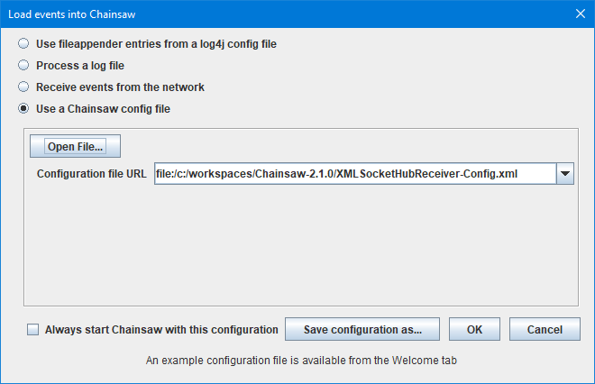
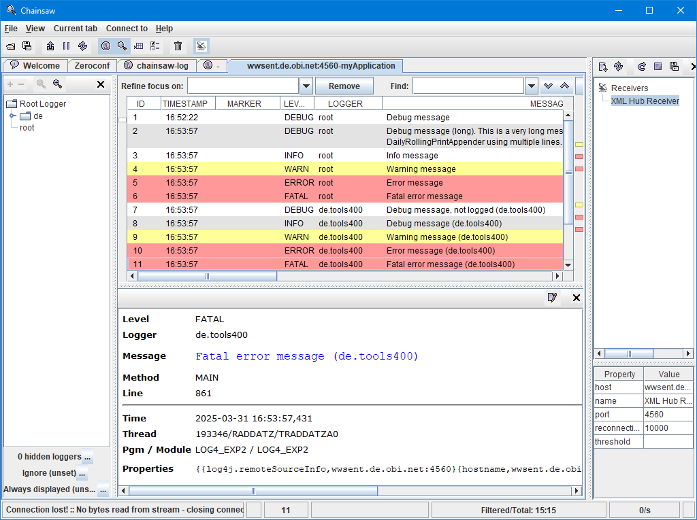

# Configuration - XML Output to Chainsaw (Hub)

This example shows how to configure a [XMLSocketHubAppender](Properties___XMLSocketHubAppende.md) using a [XMLLayout](layout/Layout___XMLLayout.md) producing XML output. The XML output is send to [Chainsaw](Chainsaw___Overview.md) on a PC.

## Configuration Data

Disables the Log4rpg internal debug log:

```properties
log4rpg.debug=off, printer
```

Sets the default log level to `ERROR` and names the default appender `chainsaw`:

```properties
log4rpg.rootLogger=ERROR, chainsawHub
log4rpg.logger.de.gfd=INFO
```

Configures the `chainsawHub` appender:

```properties
log4rpg.appender.chainsawHub=*LIBL/LOG4SHBAPP(XMLSocketHubAppender)
log4rpg.appender.chainsawHub.port=4560
log4rpg.appender.chainsawHub.layout=XMLLayout
log4rpg.appender.chainsawHub.filter=appName
```

These entries define a `XMLSocketHubAppender` which uses a `XMLLayout` and a filter named `appName`.

Configures a filter that adds a property called `application` with a value of `myApplication`:

```properties
log4rpg.filter.appName=*LIBL/LOG4PROFLT(PropertyFilter)
log4rpg.filter.appName.property.application=myApplication
```

The `PropertyFilter` is used for adding an `application` property to each log event. The value of the property (here: `myApplication`) can safely be changed to to whatever you want. By default *Chainsaw* uses the `application` property togehter with the host name to produce a tab name for the tab displaying the log events. That makes it possible to route log events of different applications to different tabs. The rule how to produce a tab name can be changed from the **Application-wide Preferences** screen, field **Tab name/event routing expression**.

## Chainsaw PC Configuration

*Chainsaw* does not come with a `XMLSocketHubReceiver` that is needed to connect to its counterpart the `XMLSocketHubAppender`. Hence you have to manually add a `XMLSocketHubReceiver` to it. Please follow these steps to enable *Chainsaw* to connect to the `XMLSocketHubAppender`:

a) Copy `XMLSocketHubReceiver.jar` into the *Chainsaw* program folder.

b) Add `XMLSocketHubReceiver.jar` to the *Chainsaw* classpath.

### Updating Chainsaw Classpath

Locate the statement setting the `CLASSPATH` variable and change it to:

```terminal
set CLASSPATH="%BASEDIR%"\etc;"%REPO%"\log4j\apache-log4j-extras\1.1\apache-log4j-extras-1.1.jar;"%REPO%"\log4j\log4j\1.2.16\log4j-1.2.16.jar;"%REPO%"\javax\jmdns\jmdns\3.4.1\jmdns-3.4.1.jar;"%REPO%"\com\thoughtworks\xstream\xstream\1.4.11.1\xstream-1.4.11.1.jar;"%REPO%"\xmlpull\xmlpull\1.1.3.1\xmlpull-1.1.3.1.jar;"%REPO%"\xpp3\xpp3_min\1.1.4c\xpp3_min-1.1.4c.jar;"%REPO%"\commons-vfs\commons-vfs\1.0\commons-vfs-1.0.jar;"%REPO%"\commons-logging\commons-logging\1.1.1\commons-logging-1.1.1.jar;"%REPO%"\com\jcraft\jsch\0.1.55\jsch-0.1.55.jar;"%REPO%"\log4j\apache-chainsaw\2.1.0\apache-chainsaw-2.1.0.jar
set CLASSPATH="%CLASSPATH%";"%REPO%"\tools400\XMLSocketHubReceiver.jar
```

c) Finally add the "XML Hub Receiver" plugin to your Chainsaw settings file (config.xml):

### Configuring XML Socket Hub Appender

On the PC you need to create a settings file with the following content and an arbitrary name that should end with `.xml`:

[XML Configuration](assets/XMLSocketHubReceiver-Config.xml)

```xml
<log4j:configuration xmlns:log4j="http://jakarta.apache.org/log4j/" debug="false">
  <plugin name="XML Hub Receiver" class="de.tools400.log4j.net.XMLSocketHubReceiver">
    <param name="Host" value="ibm_i_dns_name"/>
    <param name="Port" value="4560"/>
    <param name="reconnectionDelay" value="10000"/>
  </plugin>
</log4j:configuration>
```

### Load Configuration on Startup

The configuration file can be specified when starting *Chainsaw* like this:



If this startup screen is not shown, please go to the **Application-wide Preferences** and clear the value of property **Auto Config URL**.

The port number must match the port number specified in the `log4rpg.properties` file shown above.

### Output



The image above shows the log event details panel formatted with the configuration loaded from file [detail-panel-custom-layout-left-aligned.html](../lib/detail-panel-custom-layout-left-aligned.html).

***
© 2000-2025, Thomas Raddatz
