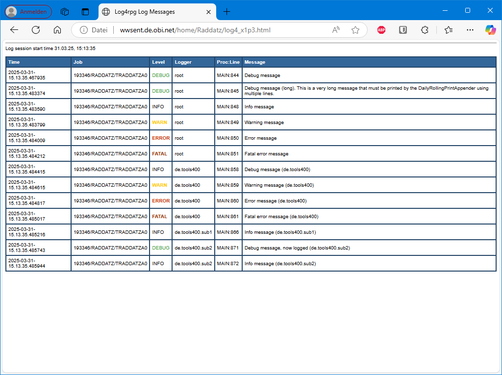

# HTMLLayout

**Service program:** LOG4HTMLAY\
**Procedure:**       HTMLLayout

| Property | Value | Comments |
|:---------|:------|:---------|
| none     |       |          |

## Additional Information

The HTMLLayout exports the following procedures:

- `HTMLLayout_getHeader()`
- `HTMLLayout_getFooter()`

These procedures are called by certain appenders, e.g.

- [RollingFileAppender](../appender/Appender___RollingFileAppender.md)
- [DailyRollingFileAppender](../appender/Appender___DailyRollingFileAppender.md)

You may override these procedures in your own HTML layouts.

## Output

***
© 2000-2025, Thomas Raddatz
