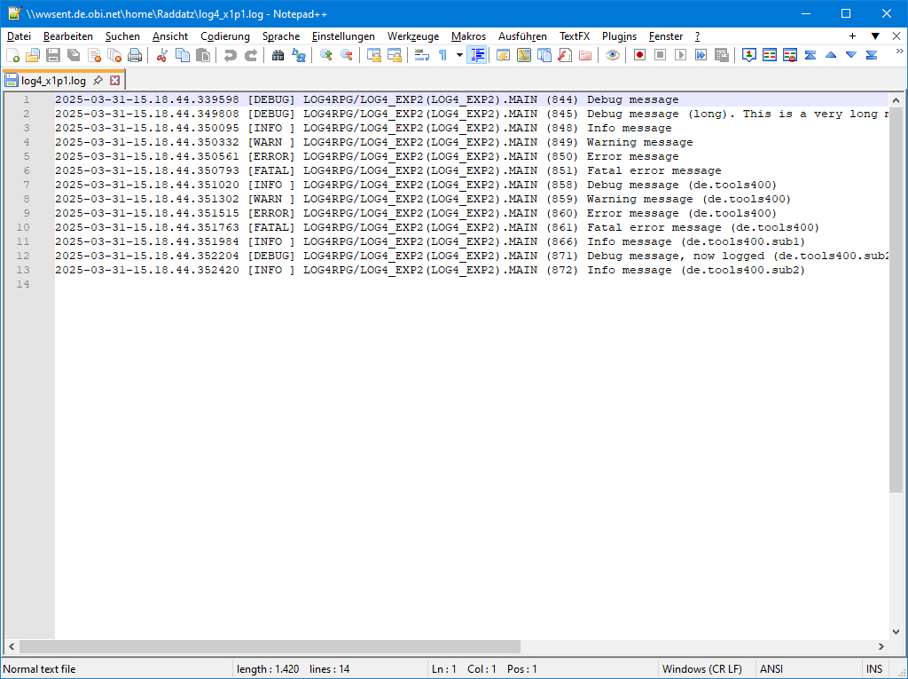

# PatternLayout

**Service program:** built-in
**Procedure:** PatternLayout

| Property          | Value   | Comments                                                                                                                                                                    |
|:------------------|:--------|-----------------------------------------------------------------------------------------------------------------------------------------------------------------------------|
| conversionPattern | pattern | Pattern specifying the layout: %p - priority %t - time %d - date %z - timestamp %l - logger name %m - log message %n - new line %P - program name %L - library name (slow!) %M - module name %F - procedure name %S - statement number %j - qualified job name %u - user name %U - current user name |
| timestampPattern  | pattern | Pattern specifying the layout: %Y - 4-digit year %d - month %d - day of week %H - Hour in 24-hour format [00-23] %I - Hour in 12-hour format [01-12] %M - Minute %S - Second %ms - microseconds The complete list of possible patterns can be found in the documentation of the `strftime()` function. |

`%L` is slow, because of the Retrieve Call Stack (QWVRCSTK) API beeing slow. All other information can be gathered by sending and retrieving a message to the call stack entry that issued the log statement.

`%ms` the default is a 6-digit microsecond value. The number of digits (1-6) can be appended to `%ms`. For example: `%ms3` produces a 3-digit microsecond value.

## Output

***
© 2000-2025, Thomas Raddatz
