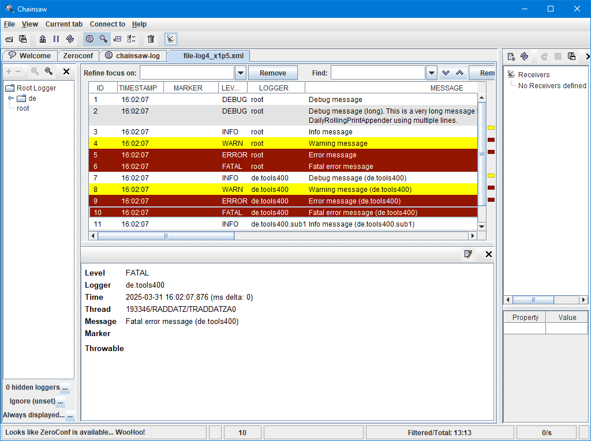

# XMLLayout

**Service program:** built-in
**Procedure:** XMLLayout

| Property                     | Value                      |                                                                                                                                                    |
|:-----------------------------|:---------------------------|----------------------------------------------------------------------------------------------------------------------------------------------------|
| replaceUnprintableCharacters | true \| false or 1 \| 0 | Specifies whether unprintable characters must be replaced or not. Characters with a hex code lower x'40' or greater x'FE' are considered to be unprintable. Usually you should set the property to `false` for better performance. |
| substitutionCharacter        | zeichen                    | Substitution chracater for unprintable characters. Default: `÷`                                                                                 |
| encoding                     | encoding-string            | Specifies the [encoding](popup_xmlEncoding_t.md) attribute of the document declaration node.                                                       |

The XMLLayout formats the log statements according to the rules established by Chainsaw utility of the Apache project. The output matches the rules specified in log4j.dtd.

Because Log4rpg is for RPG it can not know about Java classes, methods and files in the sense of object oriented programming. However it is possible to map the following RPG items to Java like this:

| Java terminology | RPG terminology           |
|:-----------------|:--------------------------|
| file             | module                    |
| class            | program / service program |
| method           | procedure                 |
| thread           | qualified job name        |

## Output

The image above shows the output formatted with the default *Chainsaw* settings.

***
© 2000-2025, Thomas Raddatz
